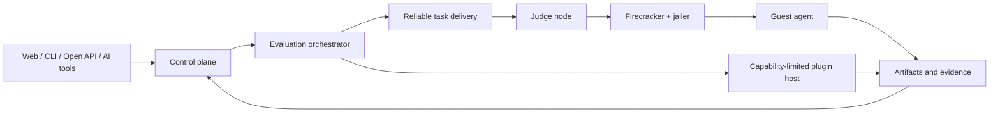

# 总体架构

OpenOJ 将领域控制、评测编排、不可信执行和扩展能力分为清晰边界。P0 采用模块化控制平面和独立 judge node，不以微服务数量作为扩展性指标。



## 控制平面

负责 Problem、Problem Version、Submission、Evaluation、用户可见状态、策略、幂等 API、调度意图和审计。控制平面不直接执行不可信命令，也不持有 microVM 内部实现假设。

P0 可以作为一个模块化 Rust 应用部署；只有获得真实扩展、故障域或独立发布需求后才拆分服务。当前 P0-B 已实现 PostgreSQL-backed application port 以及仅包含 migration、提交、状态查询的 CLI 进程组装；P0-C 增加 UDS Judge Control server 与独立 judge node；P0-D 在 control-plane 增加后台 sweeper，周期重入队过期租约，防止强杀后的任务永久停留。HTTP、身份认证和对象正文上传仍未实现。

## 评测编排

编排器把 Evaluation Plan 展开为有类型 Stage，处理依赖、取消、重试、证据和聚合。编排器不得假设算法题是唯一 Profile，也不得把具体 Firecracker API 暴露到公开协议。

标准阶段语义为：

```text
prepare -> build -> run -> evaluate/check -> aggregate -> finalize
```

Profile 可以约束、扩展或省略阶段，但必须通过能力协商和版本化契约表达。

## 执行平面

judge node 消费有租约的任务，准备经过验证的 kernel、rootfs、runtime 和 Artifact，管理 jailer/Firecracker、guest 通信、资源计量、watchdog、证据收集和强制回收。

judge node 只接收执行所需的最小数据，不接收控制平面数据库凭证或无关用户权限。guest agent 只实现有限、版本化的命令协议，不提供通用远程 shell。

## 扩展平面

扩展分为：

- 能力受限 Wasm 插件，用于轻量转换、检查和事件处理。
- 通过稳定 RPC 接入的隔离服务插件。
- 在 microVM 中运行的高级 evaluator，用于完整工具链或不可信项目。

扩展不能绕过统一 Artifact、Evidence、审计和权限模型。

## 数据与产物

- PostgreSQL 保存强一致领域状态、幂等键、租约、索引和审计元数据。
- S3 兼容对象存储保存源码、测试数据、日志、报告、镜像元数据和其他大型 Artifact。
- Artifact 以内容摘要寻址，敏感性、保留期和访问策略作为元数据管理。
- P0 使用数据库可靠任务表/outbox；已实现单项 `FOR UPDATE SKIP LOCKED` 领取、租约隔离、终态竞态保护，以及由 control-plane 后台 sweeper 驱动的过期 Attempt 恢复（`recover_expired`），在证据表明确瓶颈前不引入独立消息系统。

## 关键不变量

- Submission 不等于 Attempt，重试不改变逻辑身份。
- 历史 Evaluation 指向不可变 Problem Version 和 Runtime。
- 调度和结果提交按 at-least-once 设计，以幂等保证正确性。
- 对外协议类型与内部领域类型使用显式转换层。
- 所有跨进程消息有版本、大小上限、超时和畸形输入处理。
- 控制平面故障不能使已运行 guest 获得更多能力。
- judge node 故障不能产生无来源的最终结果。
