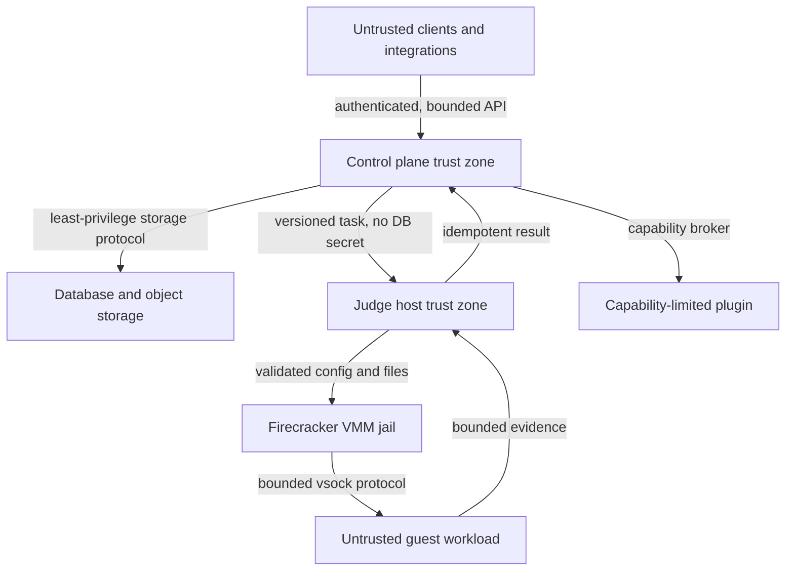

# 信任边界

## 区域

| 区域 | 信任级别 | 允许持有 | 不得持有 |
|---|---|---|---|
| 外部客户端 | 不可信 | 自身凭证、公开 Schema | 平台内部秘密、隐藏数据 |
| 控制平面 | 高 | 领域状态、授权策略、短期派生凭证 | 用户工作负载的直接执行能力 |
| PostgreSQL/对象存储 | 基础设施信任 | 按分类存储的数据 | 超出服务身份范围的访问能力 |
| judge host | 受限基础设施 | 任务最小输入、节点身份、短期授权 | 控制平面 DB 超级权限、发布根密钥 |
| Firecracker VMM jail | 敌对代码容器边界 | 单任务 kernel/rootfs/block/vsock | 其他任务资源、宿主通用文件系统 |
| guest | 完全不可信 | 单任务输入、受限输出通道 | 平台密钥、宿主 socket、默认网络 |
| 插件 | 默认不可信 | 显式 capability、预算和输入 | 原生宿主句柄、隐式网络/存储 |

## 跨边界规则

### 客户端到控制平面

必须认证授权、限制请求大小和速率、校验幂等键，并把用户内容作为数据而非日志字段。错误不得暴露内部路径、SQL、令牌或隐藏题目数据。

### 控制平面到 judge host

只传输版本化任务、Artifact 引用、不可变环境摘要、资源 Policy 和短期能力。judge node 不接受任意 shell 命令、宿主路径或控制平面数据库连接串。

P0-C 仅允许本机私有 UDS 上的 `JudgeControl` RPC：control-plane 拥有时钟、lease policy 与随机 lease token，node 的 `node_id` 只用于部署 allowlist 关联而不是密码。UDS 文件权限与 allowlist 共同降低同机误接入风险，但不构成跨主机身份认证；TCP/mTLS 必须由后续 ADR 和安全评审引入。

### judge host 到 VMM/guest

宿主验证 kernel、rootfs、磁盘和配置来源，使用独立 uid/gid、cgroup 和 jail。vsock 消息必须有版本、长度、状态、超时和取消约束。guest 的任何输出都重新按不可信输入处理。

### guest 到结果

guest 只能提交阶段性受限输出；最终 Verdict/Score 必须由宿主侧 evaluator 或明确受控的评测阶段根据证据形成。guest 自报成功不能成为最终结果。

### 插件到宿主

每次 host call 经过 capability、scope、配额、超时和审计判断。权限判断与执行应位于同一受控边界，避免公开 check/use 两步产生竞态。

## 部署约束

- 生产控制平面和执行不可信代码的 judge host 应分离部署和身份。
- 开发共机模式必须显式标记非生产，并禁止复用生产凭证。
- judge host 管理平面和任务网络分离；guest 默认没有 TAP 网络设备。
- 运行多个 VMM 时使用独立资源所有权和 cgroup；共享缓存必须按摘要与敏感级别隔离。
- 任何放宽都必须关联威胁、ADR、测试和人工批准。
