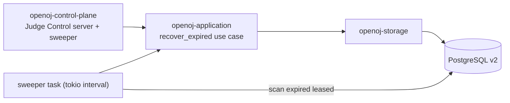

# P0-D Expired Lease Recovery 实现计划

> **For agentic workers:** REQUIRED SUB-SKILL: Use `superpowers:executing-plans` to implement this plan task-by-task. Steps use checkbox (`- [ ]`) syntax for tracking.

**Goal:** 把已 Accepted 的 `retry_expired` 存储原语接入 control-plane 进程路径，使 judge-node 被强杀后其过期租约的任务被自动重入队（新 Attempt），并可被后续节点重领完成。关闭 P0-C 验证记录中"真实进程强杀后的端到端 claim replay 未验证"的缺口。

## 问题与决策

当前状态：`retry_expired(pool, RetryExpired{now, request})` 已实现并验证（P0-B/P0-C），但没有任何进程调用它。judge-node 领取后若进程被强杀，任务永久停留在 `leased`（`lease_expires_at_ms < now` 之后也不恢复），因为没有恢复驱动。这是 `ACC-P0-003`（可靠重试）与 `FR-SCHED-001` 的核心要求。

**决策（Option A）**：control-plane 后台 sweeper 任务，周期性扫描过期租约并逐条重入队。
- 备选 B（claim 时惰性恢复）：恢复依赖节点轮询，无节点时永不恢复，不满足可靠性。
- 备选 C（judge-node 触发恢复）：让执行平面拥有控制平面职责，违背 ADR-0002 所有权边界。
Option A 与 ADR-0002（控制平面拥有可靠 task/outbox 与恢复）一致，是标准且低风险选择，不需要新增 ADR。

## 架构

- `openoj-domain`：`EvaluationRequest::with_next_attempt(new_attempt_id)` 纯逻辑，克隆并更新 `attempt_id` 与 `attempt_number+1`。
- `openoj-storage`：新增 `recover_expired(now) -> u32`，循环选取过期 `leased` 的 evaluation（`FOR UPDATE SKIP LOCKED` 单行），解码存储请求，生成新 `AttemptId`，调 `retry_expired` 原子重入队；返回恢复数。
- `openoj-application`：`EvaluationStore` port 与 `ControlPlane` 暴露 `recover_expired`。
- `openoj-control-plane`：启动后台 sweeper task，按可配置 interval 调 `recover_expired`，与 UDS shutdown 一起终止；新增 lease/recovery 配置（供测试用短租约）。

## 配置（control-plane，新增 env，均有界）

- `OPENOJ_LEASE_DURATION_MS`：默认 `30000`，范围 `1..=3_600_000`。
- `OPENOJ_RENEW_AFTER_MS`：默认 `10000`，范围 `1..<lease/2`。
- `OPENOJ_RECOVERY_INTERVAL_MS`：默认 `5000`，范围 `250..=60_000`。

## 非目标

- 不改 `.proto`、不改公开协议、不新增 crate。
- 不实现 Firecracker/KVM/guest/网络/对象存储。
- 不做多并发恢复或容量加权；恢复逐条、幂等、`SKIP LOCKED`。

## 验证

1. domain 单测：`with_next_attempt` 更新身份、attempt_number+1、其余字段不变。
2. storage 集成测试（真实 PG18）：过期 leased 被恢复为新 queued attempt、attempt 历史保留；未过期租约不恢复；已终态不恢复；并发恢复单行单一获胜。
3. 进程级回归：control-plane 短租约 + 短恢复间隔，submit 后 kill judge-node，验证任务经恢复重入队（attempt 2）并被新节点重领完成终态。
4. 全套门禁：fmt/check/clippy `-D warnings`/test/check-workspace/check-docs/cargo deny。

## 需求/验收/ADR 关联

`ACC-P0-003`、`FR-SCHED-001`、`ACC-P0-017`、`ACC-P0-018`、`ADR-0002`。

## 回退与停止条件

新增后台任务与配置可独立回退，不触碰 schema/协议/生产路径。若恢复导致重复计分、身份漂移、能力错投或终态破坏，停止 sweeper 并保留 Attempt 历史。
