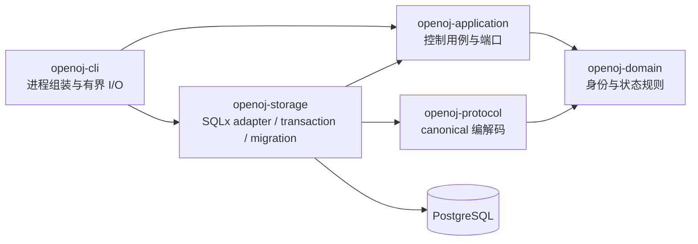

# P0-B 持久化控制链路设计

## 目标与验收边界

P0-B 在 P0-A 的有界领域和 canonical 协议之上建立首个可恢复的控制平面切片：使用 PostgreSQL 原子持久化 Problem Version、Submission、Runtime、Evaluation、Attempt、任务租约和终态结果；提供最小 CLI 完成 migration、创建 Evaluation 和查询状态；用真实数据库集成测试证明重复创建、重复投递、worker 崩溃后的显式重试、租约过期、取消/结果竞态和重复结果不会产生重复对象或重复计分。

本切片实现 `FR-SUBMISSION-001`、`FR-SCHED-001`、`FR-RESULT-001`、`NFR-REL-001`、`NFR-REL-002` 和 `NFR-COMPAT-001` 的持久化基础，并为 `ACC-P0-003`、`ACC-P0-012`、`ACC-P0-016`、`ACC-P0-017`、`ACC-P0-018` 提供早期机械证据。P0-B 不宣称这些端到端验收项已经完成。

明确非目标：HTTP/鉴权、多租户、对象存储正文、judge node、Firecracker、guest、执行期取消信号、Rejudge 产品用例、审计产品、性能 SLO 和公开协议变更。Artifact 表只保存已有 canonical 引用的有界元数据，不保存源码、日志或二进制正文。

## 已接受约束与方案比较

`ADR-0002` 已经接受“模块化 Rust 控制平面 + PostgreSQL 可靠 task/outbox + 独立 judge node”，因此本设计不创建新 ADR，也不改变信任边界。

候选方案如下：

1. application 端口 + PostgreSQL/SQLx adapter + 同库任务表。它保持领域层纯净，Evaluation/Attempt/任务/结果可以在一个事务中转换，P0 部署和恢复最简单。本设计采用此方案。
2. application 直接调用 SQLx。初期文件较少，但数据库类型、事务和错误会泄漏进用例层，违反现有 crate 方向，未来拆分 judge node 或替换 adapter 的迁移面更大，因此拒绝。
3. PostgreSQL 记录领域对象，Kafka/NATS 负责任务。它能独立扩展投递层，但 P0 需要处理跨系统一致性、额外凭证、部署和故障恢复；当前没有吞吐证据证明必要，且技术栈明确暂不引入，因此拒绝。

## 组件与依赖方向

- `openoj-domain` 新增持久化生命周期和租约 token 的纯类型、合法转换和时间/租约上限，不依赖 async 或数据库。
- `openoj-application` 新增控制平面命令、快照、投递值和 `EvaluationStore` 异步端口；它不依赖 SQLx。
- `openoj-storage` 实现端口、事务、migration、canonical 消息持久化和数据库错误分类；SQLx 类型不得出现在公开 application/domain API。
- `openoj-cli` 只解析命令、环境和有界文件，组装连接并打印有界状态；业务和事务不得放进 app crate。
- `openoj-protocol` 保持 canonical schema 的唯一转换边界。P0-B 不修改公开 schema；数据库保存由现有编码器产生并由现有解码器校验的字节。

workspace 方向检查必须同步为：`domain` 无内部依赖；`protocol -> domain`；`application -> domain` 且测试可依赖 `protocol`；`storage -> application + domain + protocol`；`openoj-cli -> application + domain + protocol + storage`。

## 领域生命周期

Evaluation 生命周期只允许以下状态：

- `queued`：存在一个可投递 Attempt。
- `leased`：当前 Attempt 被一个 node 持有未过期租约。
- `completed`、`failed`、`cancelled`：不可逆终态，分别对应 canonical result 的同名状态。

Attempt 生命周期只允许 `queued -> leased -> completed|failed|cancelled`，以及 `leased -> expired`。`expired` Attempt 永不重新激活；恢复必须显式创建 `attempt_number + 1` 的新 Attempt，并保留旧 Attempt。Evaluation 在旧 Attempt 过期与新 Attempt 原子入队后返回 `queued`。

终态不可回退，Evaluation 同一时间最多一个非终态 Attempt。创建 retry 时，Evaluation、Problem Version、Submission、Runtime、Plan、Policy 和 capability 必须与原请求相同，仅 Request ID、Attempt ID、Attempt Number 和幂等键可以变化。此比较通过 decode 后的领域值执行，不比较手写数据库字段集合。

时间使用调用方传入的 Unix epoch 毫秒，范围为 `0..=253_402_300_799_999`。租约时长范围为 `1..=3_600_000` 毫秒，加法必须检查溢出。该接口让测试不依赖真实墙钟；未来进程层负责提供可信 clock。

## 写边界与幂等语义

### 创建 Evaluation

输入是已验证的 `EvaluationRequest` 和 `created_at_ms`。单个事务执行：

1. canonical 编码并再次确认请求不超过 `262_144` 字节。
2. 注册/核对 Artifact、Problem Version、Submission 和 Runtime 的不可变元数据；同 ID 不同内容返回 `immutable_reference_conflict`。
3. 插入 Evaluation、Attempt 和一条 `ready` task。
4. 使用创建幂等键和 canonical 请求字节识别重放。

同 key + 同字节返回原快照；同 key + 不同字节返回 `idempotency_conflict`；不同 key 复用已有 Evaluation ID 或 Attempt ID 返回 `identity_conflict`。任何失败回滚整个事务。

### Claim 与租约

claim 输入 node ID、lease token、`now_ms` 和 lease duration，使用 `FOR UPDATE SKIP LOCKED` 按 `(created_at_ms, attempt_id)` 选取一条 `ready` task。事务同时把 task、Attempt 和 Evaluation 更新为 leased，并返回 canonical request、Attempt、node、lease token 和 expiry。

同一 task 在有效租约内不能被第二个 node claim。claim 不自动复活过期 Attempt；调用者必须先执行显式 retry。这样物理执行重试始终产生新 Attempt，而不是把多个执行伪装成同一个 Attempt。

### 过期恢复

`retry_expired` 输入一个新的、完整 `EvaluationRequest` 和 `now_ms`。事务锁定 Evaluation 与当前 Attempt，要求当前租约严格早于 `now_ms`，把旧 Attempt/task 标记 expired，验证不可变语义与连续 attempt number，再插入新 Attempt/task。重复 retry 使用新请求幂等键和字节返回同一结果；竞争 retry 只有一个能创建下一 Attempt。

### 结果提交

结果提交输入独立幂等键、lease token、canonical `EvaluationResult` 和 `now_ms`。事务要求：

- Evaluation 与 Attempt 身份精确匹配，Attempt 是当前 leased Attempt；
- node/lease token 匹配且 lease 在提交时未过期；
- result status 是 canonical 终态，并与目标生命周期一致；
- 结果编码不超过 `1_048_576` 字节。

成功后在一个事务中写 result、终结 Evaluation/Attempt 并完成 task。相同结果幂等键 + 相同字节返回原终态；相同 key + 不同字节返回 `idempotency_conflict`；其他 late/stale result 返回 `stale_lease` 或 `terminal_conflict`，不得覆盖已计分结果。

### 取消竞态

取消输入独立幂等键、Evaluation ID、与当前 Attempt 对应的 canonical cancelled result 和 `now_ms`。它锁定 Evaluation；若尚未终态，原子写入 cancelled result 并取消 Attempt/task。取消与正常结果提交由行锁确定唯一获胜者：先提交的终态保留，后到的不同终态返回 `terminal_conflict`；相同取消 key + 相同字节是幂等成功。P0-B 只保证控制平面不再接收计分，停止运行中 microVM 的信号与资源回收留给 execution slice。

## PostgreSQL Schema 与兼容

第一条只前向 migration 创建：

- `openoj_schema_metadata`：单行 `schema_version = 1`，供旧应用显式拒绝更新 schema。
- `artifacts`、`problem_versions`、`submissions`、`runtimes`：不可变引用元数据。
- `evaluations`：创建 key、当前状态、当前 Attempt、初始 canonical request、可选 terminal result/result key、时间。
- `evaluation_attempts`：连续 attempt number、canonical request、状态、node/lease、结果和时间；`(evaluation_id, attempt_number)` 唯一。
- `evaluation_tasks`：每 Attempt 一条 task，状态为 `ready|leased|completed|cancelled|expired`，并受外键约束。

ID/幂等键列使用与领域上限一致的 `varchar`；digest、media type、消息、时间、attempt number、lease duration 和状态都有 `CHECK`。request/result 使用 `bytea` 且分别限制在 canonical 上限。数据库不保存无限 Artifact 正文。外键和唯一索引保证引用与幂等边界，应用事务提供跨表状态一致性。

SQLx migration 可在空库执行并可重复调用；已发布 migration 永不改写。连接流程先运行显式 migration 命令，再检查 `schema_version == 1`；缺少、损坏或大于 1 均 fail closed。第一版没有旧 OpenOJ schema，因此“旧版升级”只包含空库到 v1；从 v1 到未来版本必须新增 migration 和升级 fixture。应用回滚只需回滚二进制，v1 表是加法变更且不删除数据；若新写入语义超出旧应用理解，旧应用通过 schema version 拒绝启动。

## 错误、资源与敏感信息

公开 storage/application 错误使用稳定类别：`invalid_time`、`idempotency_conflict`、`identity_conflict`、`immutable_reference_conflict`、`not_found`、`no_task_available`、`lease_conflict`、`stale_lease`、`invalid_transition`、`terminal_conflict`、`incompatible_schema`、`unavailable` 和 `corrupt_data`。错误可以保留 SQLx source 供责任边界记录，但 Display 不包含 SQL、连接串、canonical payload、用户源码或隐藏数据。

数据库连接池最大连接数必须由 CLI 配置且范围 `1..=64`；P0-B CLI 默认 4。一次 claim 最多返回一条任务，不做无界批量；文件读取在分配前检查 metadata，并最多读取协议上限加一个字节。所有消息、ID、key 和时间继续受 domain/protocol/DB 三层上限保护。

## CLI 行为

`openoj-cli` 提供三个命令：

- `migrate`：连接 `OPENOJ_DATABASE_URL` 指向的 PostgreSQL，运行 migration 并检查 schema compatibility。
- `submit <request.json>`：有界读取并 canonical decode，请求 storage 原子创建，输出 Evaluation ID、Attempt ID 和状态。
- `status <evaluation-id>`：解析有界 ID，读取快照，输出 Evaluation 状态、当前 Attempt、attempt number 和是否存在 terminal result；不打印 request/result 正文。

环境缺失、参数错误、超限输入和数据库错误返回非零退出码与脱敏消息。数据库 URL 不出现在输出或日志。

## 测试与证据

纯单元测试覆盖生命周期转换、时间/租约边界、CLI 参数和有界读取。真实 PostgreSQL 集成测试覆盖：

- 空库 migration、重复 migration 和更新 schema 拒绝；
- 创建成功、同 key 同 payload 重放、key/payload 冲突、不可变引用冲突；
- 两个 claim 竞争时只有一个获得任务；
- 有效租约拒绝重复 claim，过期后只有合法下一 Attempt 能入队；
- worker 崩溃模拟保留 expired Attempt 历史且不丢 Evaluation；
- 正常结果原子终结、重复结果不重复计分、过期或错误 token 结果被拒绝；
- 排队/leased 取消、重复取消以及取消/完成竞态只保留一个终态；
- transaction 中途违反约束时不留下半个 Evaluation、Attempt 或 task。

CI 使用隔离 PostgreSQL service，不依赖公网、真实墙钟或测试顺序。最终门禁包含 fmt、workspace check、Clippy `-D warnings`、全部测试、文档检查和依赖策略。KVM/Firecracker、真实节点崩溃、性能与生产 PostgreSQL 运维仍标记 `Unverified`。

## 依赖、迁移与回退

新增 `sqlx = 0.9.0`，关闭 default features，仅启用 `postgres`、`runtime-tokio`、`migrate`、`macros` 和 `tls-rustls-ring-native-roots`；`macros` 只用于把已发布 migration 及其 checksum 嵌入二进制，不使用在线 query macro。它要求 Rust 1.94，低于 workspace 1.97，许可证为 MIT OR Apache-2.0。新增 `tokio = 1.53.1`，关闭 default features，library/test/CLI 按需启用 `rt-multi-thread`、`macros`、`fs`，许可证为 MIT。两者来自 crates.io 官方仓库并由 `Cargo.lock` 固定。

SQLx 可被另一个 PostgreSQL adapter 替换而不改变 application/domain API，但 migration/query 重写成本中等；Tokio 是已接受运行时，移除会影响全部异步进程组装。依赖策略文档必须记录 feature、维护/许可证、替代方案和移除成本；当前许可证决策仍阻塞正式分发，不因本切片改变。

安全或数据异常时的回退触发包括：出现重复终态、租约可并发持有、migration 破坏数据或敏感 payload 泄漏。处理方式是停止新写入、回滚到上一个应用版本、保留加法 schema 与全部行供审计；不得自动删除表或改写 migration。任何数据修复必须单独设计、测试并获得人工批准。
