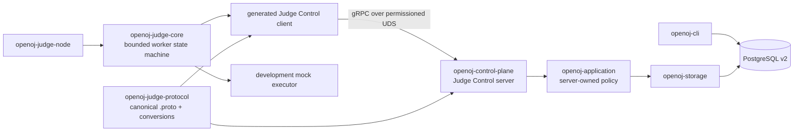

# P0-C Judge Control 与开发 Worker 设计

## 目标与验收边界

P0-C 把 P0-B 的持久化任务能力延伸到真实独立的 control-plane 和 judge-node 进程。两个进程通过版本化、消息有界的 gRPC/UDS 契约完成能力协商、单任务领取、租约续期、取消指令和幂等结果提交；judge node 使用明确的 development mock executor 形成进程级闭环，但不执行用户命令。

本切片关联 `FR-EVAL-001`、`FR-JUDGE-003`、`FR-SCHED-001`、`FR-RESULT-001`、`NFR-SEC-003`、`NFR-SEC-004`、`NFR-REL-001`、`NFR-REL-002`、`NFR-OPEN-001`、`NFR-OBS-001`，并提供 `ACC-P0-001`、`ACC-P0-003`、`ACC-P0-005`、`ACC-P0-006`、`ACC-P0-013`、`ACC-P0-016`、`ACC-P0-017`、`ACC-P0-018` 的早期 control/execution-plane 证据。它不宣称完整通过任一依赖 Firecracker 或真实 workload 的验收项。

P0-C 完成时必须能够从 CLI 创建 canonical Evaluation，由独立 control-plane RPC server 从 PostgreSQL 原子出租给独立 judge-node，至少发生一次续租或取消检查，再把 `development_mock` canonical result 幂等写回并由 CLI 查询终态。测试必须使用真实 PostgreSQL 18、真实 UDS 和真实子进程，不用 in-process transport 替代所声明的边界。

## 明确非目标

- 不实现 Firecracker、KVM、jailer、cgroup、namespace、seccomp、watchdog、guest agent 或 vsock。
- 不编译、解释或运行用户提交、checker、generator、shell、宿主路径或题目工具。
- 不下载 Artifact 正文，不接入对象存储，不签发短期 Artifact 凭证。
- 不开放 TCP、HTTP、Web、外部 API、mTLS 或跨主机节点。
- 不实现多任务并发、容量加权、公平队列、节点持久注册、排空 UI 或分布式调度。
- 不形成生产隔离、性能、高可用或跨版本滚动部署结论。
- 不修改现有 `openoj.evaluation/v0alpha1` EvaluationRequest/EvaluationResult 语义。

## 已固定决策与方案选择

ADR-0002 已固定模块化控制平面、PostgreSQL reliable task/outbox 和独立 judge node。信任边界已固定 node 无数据库凭证、消息有版本与上限、guest 结果不能自证最终判定。开放评测协议仍以现有 JSON Schema 为唯一语义来源。

P0-C 比较了进程内 trait、HTTP/JSON 和 Protobuf/gRPC 三种方案，选择 ADR-0004 提议的 Protobuf/gRPC over UDS。进程内 trait 继续用于快速单元测试；HTTP/JSON 不作为内部 node control contract。该选择需要维护者接受 ADR-0004 后才能实现。

## 架构与所有权



### `openoj-judge-protocol`

新 crate 拥有 `schemas/openoj/judge-control/v0alpha1/judge-control.proto` 的生成绑定、固定版本常量、message bounds 和显式转换。它依赖 `openoj-domain` 与 `openoj-protocol`，将 `bytes canonical_evaluation_request`/`bytes canonical_evaluation_result` 交给现有有界 codec；不得复制 Evaluation 字段或承载授权、租约策略和数据库状态机。

### `openoj-application`

新增服务端 Judge Control 用例。它接受已经由 transport/deployment 认证并映射的 node context，拥有 `Clock`、`LeasePolicy`、`LeaseTokenSource` 和 `NodePolicy` ports。node 不能提交 `now`、任意 lease duration、服务器 capability 或数据库错误分类。用例把稳定业务错误映射到 transport-neutral Judge Control error，Tonic adapter 再映射为 gRPC status。

### `openoj-storage`

继续是 PostgreSQL 状态唯一 adapter。新增 v2 forward migration 和以下原子行为：

- task 保存从 canonical request 派生的排序、去重 `required_capabilities`；claim 只选择 required set 是 node allowed set 子集的 ready task；
- Attempt 保存 `claim_operation_id`，同 node + 同 operation ID 重放返回原 lease，同 operation ID 不同 node/输入返回 conflict；
- lease token 由服务端 token source 生成并由 storage 持久化；只有当前 node/token/Attempt 可以续租或提交结果；
- renew 使用服务端 `now + lease_duration`，锁定当前 Attempt，并返回 `continue`、`cancel` 或 stale；
- queued/leased cancellation 仍由 P0-B first-terminal-wins 负责；已取消租约的 renew 返回 cancel，不复活任务。

已发布 v1 migration 不修改。v2 migration 从 canonical UTF-8 JSON request 回填 `required_capabilities`；遇到非 UTF-8、非 JSON、非数组、超限或非法 capability 时 migration 失败并保持 v1。v2 schema metadata 只在全部 DDL/backfill 成功后更新。

### `openoj-judge-core`

新 crate 拥有 transport-neutral、单并发 worker 状态机与 `JudgeControlClient`/`Executor` traits，不依赖 Tonic、SQLx 或 Firecracker。状态为：

```text
disconnected -> negotiated -> claiming -> leased -> executing -> submitting -> claiming
                                      \-> stopping
```

同一 worker 最多持有一个 lease、一个 executor future 和一个 result submission。executor 接收 canonical `EvaluationRequest`、lease cancellation signal 与有界执行上下文，返回 canonical `EvaluationResult`；P0-C 唯一实现是 deterministic development mock，不能调用进程、shell 或文件系统执行 API。

### 进程组装

- `apps/openoj-control-plane` 连接 PostgreSQL、检查 schema v2、读取 allowlist/lease/socket 配置、创建受权限保护的 UDS listener 并组装 Tonic server。它不提供公开 API。
- `apps/openoj-judge-node` 读取 node ID、capability、UDS path、deadline/backoff 与 `development_mock` executor 配置，组装 client 和 worker。没有显式 development executor 配置时 fail closed；任何 production profile 值都拒绝 mock。
- `openoj-cli` 保留 migrate/submit/status，并由 migration 命令升级到 schema v2；它不托管 RPC server。

## Judge Control v0alpha1 契约

RPC service 只包含四个 unary method，不提供 batch 或 stream：

### `Negotiate`

请求包含 exact protocol version、node ID、排序去重 capabilities 和 client limits。响应包含 accepted version、服务端允许 capabilities、lease duration、renew-after、no-task backoff 与 method message limits。node ID 必须同时存在于部署 allowlist；请求 node ID 不是认证凭证。不支持版本、空/重复/未知 capability、超过 64 个 capability 或与 allowlist 不一致时 fail closed。

### `Claim`

请求包含 version、node ID、稳定 `claim_operation_id` 和 node capabilities，不包含可信时间或 lease duration。控制平面使用服务端 clock/token source，在一个 transaction 中选择最多一条能力匹配 task。响应是 `leased` 或 `no_task`：

- `leased` 包含 Evaluation ID、Attempt ID、attempt number、lease token、expiry、canonical request bytes；
- `no_task` 包含有界 `retry_after_ms`，不把“无任务”作为 gRPC transport failure；
- 相同 node + operation ID 重试返回同一 lease；不同 node 或语义漂移返回 conflict；
- 响应丢失后 node 可用同一 operation ID 安全重试。

### `RenewLease`

请求包含 version、node ID、Evaluation/Attempt、lease token，不包含新 expiry。控制面校验当前 lease 并以服务端时钟延长。响应 directive 为 `continue` 或 `cancel`；continue 携带新 expiry/next renew，cancel 要求 executor 收到取消信号并停止形成正常结果。错误 node/token、过期、旧 Attempt 或终态均返回 stale/revoked，不延长租约。

### `SubmitResult`

请求包含 version、node ID、lease token、稳定 result operation ID 和 canonical result bytes。控制面重新 decode/validate result，要求 result identity、provenance node ID、当前 Attempt 与 transport node context 一致，再调用 P0-B terminal transaction。相同 operation ID + 相同 bytes 是成功重放；不同 bytes 是 idempotency conflict；失效 lease/取消获胜返回 stale/terminal conflict。响应只含有界 Evaluation snapshot，不回显 result。

## 边界、deadline 与资源上限

- gRPC service 全局 encoded/decoded 上限为 `1_081_344` bytes；每个 method 在转换层再执行更小上限。
- negotiate/renew/claim small request 最大 `16_384` bytes；claim response 最大 `294_912` bytes（canonical request `262_144` + envelope reserve `32_768`）；submit request 最大 `1_081_344` bytes（canonical result `1_048_576` + envelope reserve `32_768`）；small response 最大 `16_384` bytes。
- capability 数量最大 64，沿用 domain token 长度；每次 claim 最多一条任务；P0-C worker 并发固定为 1。
- lease duration 配置范围沿用 `1..=3_600_000ms`，development 默认 `30_000ms`；renew-after 必须在 `1..lease_duration/2`，默认 `10_000ms`。
- node deadlines：negotiate/claim `5_000ms`，renew/submit `10_000ms`；一次 operation 最多 5 次 transport retry，指数 backoff 从 `100ms` 到 `2_000ms`，且总时间受 lease/deadline 限制。
- no-task backoff 由服务端返回并限制在 `250..=5_000ms`，默认 `500ms`；node 必须 clamp，不能接受无限等待。
- UDS path 必须是绝对路径，父目录预先存在、非 symlink、默认 mode `0700`；server 创建 socket mode `0600`。已有非 socket 路径或不属于当前部署身份的 socket fail closed，不自动删除任意路径。
- graceful shutdown 停止新 claim，向 executor 发取消，最多等待 `5_000ms`。无法形成可信 canonical result 时不伪造终态，让 lease 到期后由显式 retry 恢复。

## 错误、取消与可观测性

业务错误使用稳定低基数类别：`unsupported_version`、`capability_denied`、`identity_denied`、`invalid_message`、`message_too_large`、`no_task`、`claim_conflict`、`stale_lease`、`terminal_conflict`、`incompatible_schema`、`unavailable` 和 `corrupt_data`。Tonic adapter 只映射类别，不返回 SQL、socket 宿主细节、token、canonical payload、源码或隐藏数据。

日志允许记录 request ID、Evaluation ID、Attempt ID、node ID、RPC method、稳定错误类别和 duration；lease token、claim/result operation ID、canonical request/result、UDS 宿主路径与数据库 URL 不进入日志或指标标签。指标 method/error/state 为低基数，领域 ID 只用于 trace/event 字段。

worker 在执行期间并行运行 renew timer。收到 cancel/revoked、RPC 明确 stale 或本地 shutdown 时触发同一个幂等 cancellation signal。development mock 必须证明取消后不提交成功结果；正常完成与 cancel 竞争仍由 P0-B terminal row lock 决定唯一终态。

## 配置与安全边界

control-plane 配置：database URL、bounded pool、UDS path、socket mode、node allowlist、每个 node allowed capabilities、lease/renew/backoff bounds。judge-node 配置：node ID、declared capabilities、UDS path、RPC deadlines、development executor。所有配置有 typed bounds；未知字段、重复 node/capability、相对 socket 路径和 production+mock 组合拒绝启动。

P0-C 的 UDS 权限和 allowlist 只证明本机部署边界。它不提供跨主机节点认证，也不证明恶意本机同身份进程隔离。judge node 不获得数据库 URL、数据库凭证、控制面 token、Artifact 长期密钥或任意网络能力。

## 数据 migration 与兼容

v2 migration 新增：

- `evaluation_tasks.required_capabilities text[] NOT NULL`，最大 64、元素符合 capability token、排序去重；
- `evaluation_attempts.claim_operation_id varchar(64)`，与 node/lease 字段一致出现；
- partial unique index 保证 `(node_id, claim_operation_id)` 对 active/historical Attempt 唯一；
- capability subset 与 ready-order 索引支持单项 claim。

现有 v1 行从 `request_payload` 严格 backfill capability；migration 事务失败不改变 schema metadata。P0-C 二进制只接受 schema v2，P0-B 二进制面对 v2 会按原行为 fail closed。由于旧二进制不能安全理解 claim replay/capability 字段，应用回滚目标是最后一个 schema-v2-compatible build；若 migration 后尚无新写入，可以从已验证的迁移前备份恢复。不得手工把 version 改回 1。

Judge Control 版本矩阵只声明 `v0alpha1 client <-> v0alpha1 server`。开放 Evaluation protocol 仍是 `v0alpha1`；RPC package 与 Evaluation payload 各自验证。未知 RPC version、未来 capability 和不支持组合 fail closed，不宣称新旧 judge node 滚动兼容。

## 依赖与生成

直接依赖精确固定：`tonic 0.14.6`（MIT，MSRV 1.88）、`prost 0.14.4`（Apache-2.0，MSRV 1.85）、`tonic-prost-build 0.14.6`（MIT，MSRV 1.88）、`protoc-bin-vendored 3.2.0`（MIT）和 `tokio-stream 0.1.19`（MIT，MSRV 1.71）。workspace Rust 1.97 满足已声明 MSRV。

关闭 Tonic 默认 feature 后，只启用生成 client/server 与 UDS connector/listener 所需的 codegen、channel、server/transport 能力；不启用 gzip、zstd 或 TLS feature，应用代码不得创建 TCP listener。vendored protoc 只作为 build dependency，解决开发和 CI 工具链漂移；必须记录其平台二进制来源与 lockfile，cargo-deny 检查 advisories/bans/sources。`.proto` 是 Judge Control 唯一 wire 事实源，generated Rust 位于 `OUT_DIR`，不得手工提交第二份生成绑定；descriptor set 作为契约测试输入生成并与 fixture 验证。

## 测试与证据

### 协议与转换

- exact version success；未知/空版本拒绝；未知、重复、超限 capability 拒绝；字段与 encoded message 上限边界。
- canonical request/result 正向转换；畸形、超限、unknown Evaluation field/value 和身份/provenance 漂移拒绝。
- descriptor 可生成；producer/consumer 只声明 v0alpha1/v0alpha1；gRPC status 不包含敏感 payload/token/path。

### application 与 storage

- server clock/token/policy 被精确使用，node 输入不能覆盖；node allowlist/capability default deny。
- PostgreSQL 18 空库 v1→v2、重复 migrate、严格 backfill、失败 rollback、schema 过新拒绝。
- 两 node 不同 capability 只领取匹配 task；同 claim operation 重放同 lease；竞争 claim 单一获胜；错误 node/token、过期 lease、old Attempt renew/submit 拒绝。
- renew 延长当前 lease；queued/leased cancel 在下一 renew 返回 cancel；cancel/complete 竞态保留一个终态。

### worker 与进程边界

- fake client/executor 覆盖 no-task backoff、至少一次 renew、transport retry、response-loss claim replay、executor cancel、stale lease、result replay 与 graceful shutdown。
- 真实 PostgreSQL 18 + UDS + control-plane/judge-node 子进程：CLI submit → mock claim/renew/submit → CLI terminal status；断开 socket、重启 node、重复 result 不丢 Evaluation、不重复终态。
- 确认 development mock 不调用用户进程，不读取 Artifact 正文，结果 `production_eligible = false`；production+mock 配置拒绝启动。

最终门禁包含 fmt、workspace check、Clippy `-D warnings`、全部测试、`.proto`/descriptor 生成、依赖方向、文档、cargo-deny 和 `verify-openoj`。真实 KVM/Firecracker、用户 workload、TCP/mTLS、跨主机、生产身份、performance 和长期故障恢复保持 `Unverified`。

## 实施切片

1. 接受 ADR-0004，建立 `.proto`、protocol crate、descriptor/conformance 与依赖策略。
2. 扩展 domain/application 的 node context、server-owned lease policy、renew directive 和稳定错误。
3. 新增 PostgreSQL v2 migration、capability dispatch、claim replay 与 renew transaction。
4. 实现 `openoj-judge-core` 单并发状态机和 deterministic development mock executor。
5. 实现 control-plane/judge-node UDS adapters、typed config、deadline、权限与关闭语义。
6. 完成真实双进程 PostgreSQL 闭环、故障测试、运维/架构/安全/验证文档和 CI。

每个切片采用 RED → observed expected failure → GREEN → refactor，形成可构建、可审查、带 `Refs:`/`Tests:`/`Unverified:` 正文且无 `Co-authored-by:` 的独立提交。普通变更只通过 PR 合入 `dev`，不触碰 `main`。

## 回退与停止条件

出现多重有效租约、能力错投、取消后成功计分、RPC 身份绕过、migration 数据损坏或敏感 payload/token 泄漏时，停止新 claim/renew/result 写入，保留数据库、socket 日志的脱敏元数据和全部 Attempt 历史。不得自动删除 schema、改写 migration、伪造失败结果或回退到宿主执行。

若 UDS 不能满足独立进程测试、Tonic 无法在不开放 TCP 的条件下提供有界 transport、v1 backfill 不能保持严格语义，或安全实现需要同身份恶意进程隔离，则停止 P0-C 实现并回到 ADR 评审，不以放宽验证或默认允许继续。
