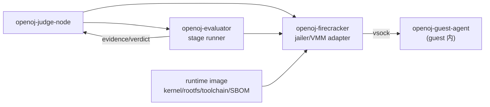

# P0-D 执行平面设计：Firecracker 评测执行

## 目标与验收边界

把 P0-C/P0-D 建立的可靠调度闭环延伸到不可信代码的真实执行：judge node 通过 jailer 启动 Firecracker microVM，guest 内编译运行，宿主侧 evaluator 检查与计分，返回结构化结果与来源。本设计只定义最小可交付切片与强制层，不承诺生产隔离、性能或容量结论。

关联 `FR-JUDGE-001/002/003`、`FR-RUNTIME-001`、`FR-RESULT-001` 与 `ACC-P0-001/002/005/007/008/009/010/015/016/017/018`。

## 明确非目标

- 不实现多语言矩阵、交互题、任意工程工作流、多模态或 AI 评测。
- 不开放 guest 网络；不实现 TAP、NAT、代理或 DNS。
- 不实现快照/预热缓存、跨任务共享缓存、对象存储正文上传或短期 Artifact 凭证。
- 不实现多任务并发、容量加权、公平队列、节点排空 UI。
- 不声明生产隔离、吞吐/延迟/密度、长期资源回收或高可用结论。

## 组件与所有权



- `openoj-firecracker`：唯一平台/特权适配器，封装 jailer/VMM、vsock、block、生命周期与回收。
- `openoj-evaluator`：transport/VMM-neutral 阶段执行；只依赖 canonical Evaluation 语义。
- `openoj-guest-agent`：guest 内最小二进制，实现受限 vsock 命令协议。

## 生命周期状态机

```text
idle -> provisioning -> booted -> building -> running -> checking -> submitting
        \-> failed(reclaimable)          \-> cancelled
        \-> cancelled(cleanup)
```

不变量：

- 同一任务最多一个 VMM 与一个 executor future；租约/Attempt 校验沿用 P0-C。
- 每个阶段保存状态、起止/资源摘要、有界诊断与 Evidence 引用；阶段失败不伪造后续成功。
- 取消在任何阶段发起都收敛到确定终态并释放 VMM；取消/完成竞态沿用 first-terminal-wins。
- 回收幂等：重复 teardown、VMM 无响应/watchdog 强杀、宿主重启后 reconciler 清理残留。
- VMM 无响应、guest panic/reboot、vsock 异常关闭、畸形/超限消息与阶段超时均触发确定失败路径。

## Jailer 与 VMM 配置

- 独立 uid/gid；chroot 到单任务目录；目录 `0700`，socket/设备文件 `0600`。
- cgroup：cpu（配额/权重）、memory（硬上限）、pids（进程数）、io（带宽/优先级）。
- namespace：mount/pid/net/ipc/uts 隔离；seccomp 过滤器（Firecracker 自带 + jailer 外层）。
- Firecracker machine-config：`vcpu_count`、`mem_size_mib` 来自 Evaluation Policy，有界。
- block：只读内核/rootfs + 受限工作盘；不暴露宿主任意路径。
- vsock：宿主端固定 CID，guest 内固定端口；单一、版本化、有界消息协议。
- 生产 Profile 缺失任一强制层时 fail closed；development mock 不得被生产配置选择。

## Guest/Host vsock 契约（设计级）

- 消息有 `message_type`、版本、长度上限、状态与超时；内容为 canonical JSON/二进制分块。
- 最小命令集：`negotiate`（版本/能力）、`upload_input`、`build`、`run`、`stage_evidence`、`cancel`、`heartbeat`。
- guest 不能自证终态：check 结果与最终 Verdict/Score 由宿主 evaluator 依据证据形成。
- 每类消息上限、超时与畸形输入拒绝路径随实现按 `evolve-openoj-protocol` 流程落地为 canonical schema。

## 资源边界（来自 Evaluation Policy）

- 上限：CPU 时间、墙钟、内存、进程数、磁盘、I/O、输出字节、日志字节、队列长度、重试次数。
- 溢出/超限：按 Policy 返回确定性失败或截断，不泄漏宿主路径/秘密，不无限增长。
- 观察：resource usage、stage 起止、诊断与 Evidence 引用进入结构化结果；敏感内容脱敏。

## 运行时供应链

- kernel、rootfs、guest agent、toolchain 为不可变、内容摘要寻址对象，记录构建来源、依赖锁定、许可证状态与 SBOM。
- 摘要/架构不匹配时执行被拒绝；缓存按摘要与敏感级别隔离。
- 最小切片使用固定 Runtime（单语言）与预构建 rootfs；新版本前向增加，旧 Evaluation 解析到不可变版本。

## 最小切片（ACC-P0-001）

1. 固定 Runtime image（kernel + rootfs + guest agent + 单语言 toolchain，记录摘要/SBOM）。
2. `openoj-firecracker` 实现 jailer 启动、vsock、block、生命周期与幂等回收。
3. `openoj-guest-agent` 实现受限命令协议（upload/build/run/evidence/cancel）。
4. `openoj-evaluator` 实现 prepare/build/run/check/aggregate 阶段与宿主侧 check。
5. judge node 组合：领取任务 → 启动 VMM → guest build/run → 宿主 check → 幂等提交结果。
6. 真实 KVM 上执行 `ACC-P0-002` 恶意 workload、`ACC-P0-017` 取消竞态与回收测试。

## 验证与证据

- 阶段测试：VMM 状态机、jailer 配置、vsock 契约、资源边界、供应链拒绝、回收幂等。
- 恶意 workload 测试：CPU 循环、内存膨胀、fork/线程膨胀、磁盘写满、无限输出、超时、guest hang/panic/reboot、vsock 畸形消息。
- 性能与隔离结论：release 构建 + 固定 workload + 记录环境（硬件/内核/KVM/Firecracker/镜像摘要/预热/重复次数/原始数据）。
- 本机 KVM（API v12，8 vCPU）+ Firecracker 1.16.1 已通过 hello 镜像启动验证；这是目标环境证据起点，不是生产隔离证明。
